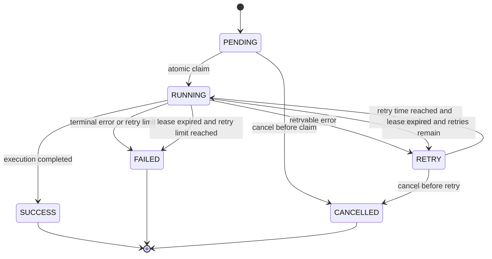

# Worker and Task Engine v2 Architecture

- Status: Proposed
- Target release: v0.2 Foundation
- Scope: Worker process boundary, task state machine, execution history, claim and lease protocol
- Last updated: 2026-07-23

## Decision summary

MediaSync v0.2 will separate the API, scheduler, and worker into independent
processes while continuing to use SQLite and a single worker by default.

The API and scheduler may enqueue tasks, but only the worker may execute tasks
or perform execution-state transitions. Task queue state will remain in
`tasks`; every execution attempt will be recorded in `task_runs`.

The default deployment will deliberately avoid Redis, RabbitMQ, Celery, and
Kubernetes. A future PostgreSQL backend may support multiple workers, but that
is not a v0.2 requirement.

Normative terms such as **MUST**, **MUST NOT**, **SHOULD**, and **MAY** describe
requirements that implementations are expected to follow.

## 1. Background

MediaSync v0.1 runs the API and all background work in one FastAPI process:

```text
FastAPI
├── HTTP API
├── APScheduler
├── scan execution
└── transfer execution
```

This was appropriate for validating the feature MVP, but it couples background
work to the API lifecycle:

- Restarting or upgrading the API interrupts synchronization work.
- A slow provider request can occupy the API event loop and database session.
- Manual scans run through FastAPI `BackgroundTasks`.
- APScheduler directly invokes scan and transfer services.
- Queue state, execution history, and user-facing logs share the `tasks` table.
- In-process scheduler locks and request throttles do not coordinate across
  multiple processes.
- There is no atomic task claim, lease, heartbeat, or fencing mechanism.
- Horizontal API scaling would also duplicate schedulers and workers.

MediaSync is moving from a single-machine tool to a service that users should
be able to leave unattended on a NAS.

The target topology is:

```text
                    mediasync-api
                         │
                         │ enqueue and query
                         ▼
                       SQLite
                      ▲      ▲
          enqueue due │      │ claim and execute
          scans       │      │
        mediasync-scheduler   mediasync-worker
```

All three processes use the same backend image and codebase, but start with
different commands.

### 1.1 Goals

v0.2 MUST provide:

- Task durability across API, worker, scheduler, and NAS restarts.
- Atomic task claiming with no duplicate ownership.
- Worker leases, heartbeats, crash detection, and recovery.
- Idempotent scheduling and transfer task creation.
- A durable execution history for every attempt.
- Traceability from a subscription or file to its task and runs.
- A default SQLite plus single-worker deployment suitable for NAS users.
- Clear boundaries that allow Provider SDK v2 to be introduced afterwards.

### 1.2 Non-goals

This design does not introduce:

- New cloud-drive providers.
- Multiple workers on SQLite.
- Redis, RabbitMQ, Celery, Kafka, or another external queue.
- Kubernetes or a cloud-native control plane.
- Multi-user authorization.
- STRM generation or media-library integrations.
- A general-purpose workflow engine.

## 2. Process boundary

The process boundary is an architectural invariant, not a deployment
suggestion.

### 2.1 `mediasync-api`

The API process owns synchronous user intent and read models.

It MAY:

- Create, edit, enable, disable, and delete subscriptions.
- Manage cloud accounts and credentials.
- Query tasks and task runs.
- Enqueue a manual scan task.
- Enqueue a user-requested retry.
- Return dashboard and health information.

It MUST NOT:

- Execute a scan or transfer.
- Invoke a Provider for background synchronization after returning an HTTP
  response.
- Use FastAPI `BackgroundTasks` for synchronization.
- Move a task into `RUNNING`, `RETRY`, `SUCCESS`, or `FAILED`.
- Recover expired leases.
- Start APScheduler.

An API endpoint that manually triggers a scan creates or returns a queued task
and responds with HTTP `202`.

### 2.2 `mediasync-scheduler`

The scheduler has one business responsibility:

```text
find due subscriptions
        ↓
enqueue SCAN tasks
        ↓
advance next_scan_at
        ↓
finish
```

It MAY:

- Read enabled subscriptions whose `next_scan_at` is due.
- Insert idempotent `SCAN` tasks.
- Advance `subscription.next_scan_at`.
- Publish its service heartbeat.

It MUST NOT:

- Execute scans or transfers.
- Claim tasks.
- Refresh cloud credentials.
- Call cloud-drive Providers.
- Perform task retries or lease recovery.

Enqueuing a scheduled task and advancing `next_scan_at` MUST occur in the same
database transaction. The idempotency key MUST be derived from the
subscription and scheduled occurrence, for example:

```text
scan:{subscription_id}:{scheduled_for_utc}
```

If the scheduler repeats the same occurrence after a crash, the unique
idempotency key makes the insert harmless.

Only one scheduler process is supported in the default v0.2 deployment.

### 2.3 `mediasync-worker`

The worker is the only task executor and the only owner of execution-state
transitions.

It MUST:

- Atomically claim one eligible task.
- Create a `task_runs` row for every attempt.
- Maintain the task lease while executing.
- Dispatch the task to the matching executor.
- Persist domain changes and the terminal run result.
- Enqueue idempotent transfer tasks discovered by a scan.
- Recover expired leases.
- Publish its service heartbeat.

The default v0.2 deployment runs one worker process with controlled local
concurrency. Initial production configuration SHOULD use concurrency `1`.

### 2.4 Shared domain code

API, scheduler, and worker may share:

- SQLAlchemy models and repositories.
- Pydantic/domain data structures.
- Task enqueue helpers.
- Provider implementations.
- Credential encryption and configuration.

Execution functions MUST NOT be imported by API routers. Scheduler code MUST
not import scan or transfer executors.

## 3. Task state machine

Task types initially remain:

- `SCAN`
- `TRANSFER`

Canonical state names are shown in uppercase. Database values SHOULD use stable
lowercase strings.

### 3.1 States

| State | Meaning |
|---|---|
| `PENDING` | Ready to be claimed immediately. |
| `RUNNING` | Owned by a worker with a valid lease. |
| `RETRY` | Waiting until `next_attempt_at` after a retryable failure. |
| `SUCCESS` | Completed successfully. |
| `FAILED` | Terminal failure or retry budget exhausted. |
| `CANCELLED` | Explicitly cancelled before completion. |

### 3.2 State transitions



An expired lease MAY return directly to `PENDING` when the recovery delay is
zero. Otherwise it enters `RETRY` with a calculated `next_attempt_at`.

Terminal states MUST NOT transition back to a runnable state. A user retry
creates a new business task or an explicitly linked successor task; it does
not erase the old task or its runs.

### 3.3 State ownership

| Transition | Owner |
|---|---|
| Create `PENDING` task | API, scheduler, or worker executor |
| `PENDING/RETRY → RUNNING` | Worker claim operation |
| Extend `RUNNING` lease | Owning worker |
| `RUNNING → SUCCESS/RETRY/FAILED` | Owning worker |
| Recover expired `RUNNING` | Worker recovery loop |
| `PENDING/RETRY → CANCELLED` | Task Engine command |

All transitions MUST go through the Task Engine repository. Services and API
routers MUST NOT assign task status strings directly.

## 4. Atomic claim design

The following pattern is unsafe:

```sql
SELECT id
FROM tasks
WHERE status = 'pending'
LIMIT 1;

UPDATE tasks
SET status = 'running'
WHERE id = ?;
```

Two workers can select the same row before either update commits.

### 4.1 SQLite claim

SQLite 3.35 or newer supports `UPDATE ... RETURNING`. The worker SHOULD claim a
task using one statement and one short transaction:

```sql
UPDATE tasks
SET
    status = 'running',
    locked_by = :worker_id,
    lock_token = :lock_token,
    locked_at = :now,
    lease_until = :lease_until,
    updated_at = :now
WHERE id = (
    SELECT id
    FROM tasks
    WHERE status IN ('pending', 'retry')
      AND (next_attempt_at IS NULL OR next_attempt_at <= :now)
    ORDER BY priority DESC, created_at ASC
    LIMIT 1
)
  AND status IN ('pending', 'retry')
RETURNING *;
```

Returning one row means the claim succeeded. Returning no row means no task
was claimed and the worker may wait before polling again.

The claim transaction MUST also:

1. Determine the next run number.
2. Insert a `task_runs` row with status `running`.
3. Commit before any Provider or network call begins.

SQLite permits only one writer at a time, which is acceptable for the default
single-worker topology. Transactions MUST remain short, and a bounded
`busy_timeout` SHOULD be configured.

### 4.2 Fencing

`locked_by` alone is not sufficient. A paused worker might resume after its
lease has expired and another worker has reclaimed the task.

Every claim MUST generate an unpredictable `lock_token`. Heartbeat and
completion updates MUST match:

```sql
WHERE id = :task_id
  AND status = 'running'
  AND locked_by = :worker_id
  AND lock_token = :lock_token
```

If the update affects zero rows, the worker has lost ownership and MUST NOT
write a terminal result.

### 4.3 Future PostgreSQL claim

PostgreSQL may later use `SELECT ... FOR UPDATE SKIP LOCKED`, but that does not
change the Task Engine contract. Database-specific claim SQL belongs behind a
repository interface.

Multiple workers are not supported on SQLite even though the claim protocol is
designed to remain safe.

## 5. Lease and heartbeat

Initial defaults:

- Lease duration: 90 seconds.
- Heartbeat interval: 30 seconds.
- Worker task poll interval: 1–3 seconds with jitter.
- Recovery check interval: 30 seconds.

These values MUST be configurable.

### 5.1 Heartbeat

While a task is running, the owning worker periodically executes:

```sql
UPDATE tasks
SET
    lease_until = :new_lease_until,
    updated_at = :now
WHERE id = :task_id
  AND status = 'running'
  AND locked_by = :worker_id
  AND lock_token = :lock_token;
```

Heartbeat uses a separate, short-lived database session. A scan or transfer
MUST NOT hold an open database transaction while waiting for a Provider HTTP
request.

If heartbeat affects zero rows, the executor has lost ownership and MUST stop
at the next safe cancellation point.

### 5.2 Expired lease recovery

The worker recovery loop searches for:

```text
status = RUNNING
and lease_until < now
```

For each expired task, it atomically:

1. Marks the active `task_run` as `lost`.
2. Stores a reason such as `WORKER_LEASE_EXPIRED`.
3. Increments the task retry counter.
4. Clears `locked_by`, `lock_token`, `locked_at`, and `lease_until`.
5. Moves the task to:
   - `PENDING` when immediate recovery is allowed;
   - `RETRY` when backoff is required;
   - `FAILED` when the retry budget is exhausted.

Recovery MUST be idempotent. Only a row still carrying the expired
`lock_token` may be recovered.

### 5.3 Graceful shutdown

On shutdown, a worker:

1. Stops claiming new tasks.
2. Continues heartbeat for the current task.
3. Attempts to finish within a configurable grace period.
4. Stops without falsely marking success if the grace period expires.

If interrupted, normal lease recovery handles the unfinished run.

## 6. Separating `tasks` and `task_runs`

### 6.1 `tasks`

A task represents one durable business intent, such as:

```text
scan subscription 42 for the 2026-07-23T10:00:00Z occurrence
```

Proposed fields:

| Field | Purpose |
|---|---|
| `id` | Primary key. |
| `type` | `scan` or `transfer`. |
| `status` | Queue state. |
| `priority` | Higher value claims first. |
| `subscription_id` | Related subscription, when applicable. |
| `file_id` | Related indexed file, when applicable. |
| `payload` | Versioned JSON for task-specific immutable input. |
| `idempotency_key` | Unique business-operation key. |
| `retry_count` | Completed unsuccessful attempts. |
| `max_retries` | Retry budget. |
| `next_attempt_at` | Earliest retry time. |
| `locked_by` | Current worker instance. |
| `lock_token` | Fencing token for the current claim. |
| `locked_at` | Claim timestamp. |
| `lease_until` | Ownership expiry. |
| `last_error_code` | Latest normalized error code. |
| `last_error_message` | Latest sanitized error summary. |
| `created_at`, `updated_at` | Audit timestamps. |
| `completed_at` | Terminal completion timestamp. |

Recommended indexes:

```text
UNIQUE(idempotency_key)
INDEX(status, next_attempt_at, priority, created_at)
INDEX(subscription_id, created_at)
INDEX(file_id, created_at)
INDEX(status, lease_until)
```

### 6.2 `task_runs`

A task run represents one execution attempt:

```text
task 123
├── run 1: failed because the network was unavailable
└── run 2: succeeded after retry
```

Proposed fields:

| Field | Purpose |
|---|---|
| `id` | Primary key. |
| `task_id` | Parent task. |
| `run_number` | Monotonic attempt number per task. |
| `worker_id` | Worker that executed the attempt. |
| `lock_token` | Claim token associated with the attempt. |
| `status` | `running`, `success`, `failed`, `lost`, or `cancelled`. |
| `started_at`, `finished_at` | Attempt timing. |
| `last_heartbeat_at` | Last confirmed activity. |
| `duration_ms` | Derived execution duration. |
| `result_summary` | Human-readable sanitized summary. |
| `error_code`, `error_message` | Normalized failure information. |
| `metrics` | Versioned JSON metrics. |
| `created_at`, `updated_at` | Audit timestamps. |

`UNIQUE(task_id, run_number)` is required.

Example scan metrics:

```json
{
  "schema_version": 1,
  "folders_scanned": 100,
  "items_seen": 1200,
  "items_discovered": 5,
  "transfer_tasks_created": 5,
  "api_request_count": 112
}
```

Task runs are retained by default in v0.2. Any future archival policy must
preserve aggregate results and must not silently delete recent failure
evidence.

### 6.3 Atomic completion

Task completion and domain-state changes MUST commit atomically where
practical. For example, a successful transfer transaction should update:

- The file record.
- The task state.
- The current task run.

The terminal update MUST include the ownership fencing conditions. If the
worker no longer owns the task, it MUST not mark the file or task successful.

## 7. Execution model

### 7.1 Scan execution

A `SCAN` executor:

1. Loads an immutable task input and current subscription.
2. Validates that the subscription still exists and is enabled.
3. Performs Provider calls without holding a long database transaction.
4. Writes scan checkpoints in bounded batches.
5. Enqueues idempotent `TRANSFER` tasks for discovered files.
6. Records scan metrics in the current task run.
7. Finalizes the task using its lock token.

Transfer task keys SHOULD continue to include the source file identity and
fingerprint:

```text
transfer:{subscription_id}:{remote_file_id}:{fingerprint}
```

### 7.2 Transfer execution

A `TRANSFER` executor:

1. Loads the indexed file, subscription, and target reference.
2. Resolves or validates the target folder.
3. Applies the configured conflict/idempotency policy.
4. Performs the Provider transfer.
5. Updates the file and run result atomically.

`target_folder_id` SHOULD become the stable target reference in v0.2.
Repeated path traversal for every file should be removed after the Task Engine
split.

### 7.3 Error classification

Executors return normalized outcomes rather than assigning task status
directly:

```text
Success(result, metrics)
RetryableFailure(code, message, retry_after)
TerminalFailure(code, message)
OwnershipLost
```

Provider exceptions must be mapped into these outcomes. Raw provider responses,
tokens, cookies, and credentials MUST NOT be stored in task or run messages.

## 8. Provider refactor order

Provider SDK v2 is required for future cloud drives, but it MUST follow the
Task Engine and worker split:

```text
Task Engine contract
        ↓
Worker execution boundary
        ↓
Provider SDK v2
        ↓
Generic credential model
        ↓
Additional Providers
```

The reason is structural: Provider SDK v2 changes the entire execution call
chain. Refactoring it before defining task ownership, retries, and execution
results would likely require a second rewrite.

Provider SDK v2 should later separate:

```text
AccountProvider
CredentialProvider
ShareProvider
StorageProvider
TransferProvider
```

No new Provider should be added during v0.2 Foundation.

## 9. SQLite and deployment model

The supported default is:

```text
SQLite WAL
+ one API process
+ one scheduler process
+ one worker process
```

Requirements:

- All processes mount the same local data volume.
- SQLite storage MUST be on a filesystem with reliable locking.
- Network filesystems are not supported unless explicitly validated.
- Transactions around queue operations MUST be short.
- Provider network calls MUST occur outside write transactions.
- Docker Compose MUST start database migrations before normal processing.
- Scheduler and worker MUST wait until migrations are complete.

Future advanced mode may use:

```text
PostgreSQL
+ multiple API processes
+ one scheduler
+ multiple workers
```

PostgreSQL and multiple workers are not v0.2 acceptance requirements.

## 10. Failure behavior

| Failure | Required behavior |
|---|---|
| API restart | Existing worker tasks continue. |
| Frontend rebuild | No effect on scheduler or worker. |
| Scheduler restart | Existing tasks continue; due scans are enqueued after restart. |
| Worker crash | Lease expires, run becomes `lost`, task is retried or failed. |
| NAS restart | Non-terminal tasks recover after services restart. |
| Network outage | Retryable failures use bounded exponential backoff. |
| Provider rate limit | Honor `Retry-After` where available. |
| Token expiry | Credential refresh is attempted once under account-level coordination. |
| Database busy | Retry short queue transactions with bounded backoff. |
| Duplicate scheduler tick | Unique task key prevents duplicate scan intent. |
| Duplicate file discovery | Unique transfer key prevents duplicate transfer intent. |
| Stale worker resumes | `lock_token` fencing prevents stale completion. |

## 11. Observability and health contract

Every process MUST have a stable instance ID and publish a heartbeat.

The API health response should eventually distinguish:

```json
{
  "api": true,
  "database": true,
  "worker": true,
  "scheduler": true
}
```

Task logs must carry:

- `task_id`
- `task_run_id`
- `worker_id`
- `subscription_id`, when applicable
- request/correlation ID, when applicable

Application logs are not a substitute for `task_runs`, and `task_runs` are not
a substitute for application logs.

## 12. Migration strategy

The migration must be additive and recoverable:

1. Add claim, lease, retry, priority, and completion fields to `tasks`.
2. Add `task_runs`.
3. Backfill existing task statuses and execution history.
4. Add Task Engine repositories and tests without changing the runtime entry
   point.
5. Add worker and scheduler commands behind explicit configuration.
6. Disable in-process APScheduler and FastAPI synchronization background tasks.
7. Update Docker Compose to start API, scheduler, and one worker.
8. Observe a migration release before removing compatibility code.

Alembic is the only production schema migration authority.
`Base.metadata.create_all()` must not be used to upgrade an existing database.

Rollback documentation must explain:

- Which migration versions are compatible with the previous application.
- How to stop worker and scheduler safely.
- How to restore a pre-migration SQLite backup.

## 13. Verification plan

At minimum, automated integration tests must cover:

- Two claim attempts cannot own the same task.
- A heartbeat extends only the matching lock token.
- A stale worker cannot finalize a reclaimed task.
- An expired lease produces a lost run and a retry.
- Retry exhaustion produces one terminal failed task.
- Scheduler restarts do not duplicate scheduled scan tasks.
- Worker restart recovers pending and expired tasks.
- API restart does not interrupt worker execution.
- A scan that discovers the same file twice creates one transfer task.
- Network failure followed by recovery completes without losing the task.
- NAS-style full service restart recovers all non-terminal tasks.
- Migration from the v0.1 schema preserves task and file history.

Reliability testing should include:

- A share containing at least 1,000 items.
- Temporary network loss.
- Provider 429 and 5xx responses.
- Expired and rotated tokens.
- Worker termination during scan and transfer.
- Database lock contention.
- Repeated Docker Compose restarts.

Before beginning Quark Drive work, the v0.2 architecture should run under the
maintainer's real NAS workload for an extended dogfooding period.

## 14. v0.2 Foundation acceptance criteria

The release goal is:

> MediaSync can run unattended on a NAS for weeks.

v0.2 Foundation is accepted when:

- NAS restarts recover all non-terminal tasks.
- API and frontend restarts do not interrupt synchronization execution.
- Worker crashes recover through lease expiry.
- Network failures retry automatically with bounded backoff.
- Expired or rotated tokens do not silently lose tasks.
- Duplicate scheduler ticks and repeated scans do not create duplicate
  transfers.
- Every execution attempt is traceable through a task run.
- Database backup and restore procedures are documented and tested.
- CI validates backend tests, frontend build, migrations, and Docker images.

Suggested README wording for the release:

```text
v0.2 Foundation

Goal: MediaSync can run unattended on NAS for weeks.
```

## 15. Implementation order

The proposed v0.2 Foundation work order is:

1. Worker and Task Engine architecture — this document.
2. Task state machine and `task_runs` schema.
3. Worker process and executor dispatch.
4. Atomic claim, heartbeat, lease recovery, and fencing.
5. Scheduler enqueue-only process.
6. Provider SDK v2.
7. Generic credential management.
8. Target-folder ID and cache.
9. Structured logging and service health.
10. Database backup and restore.
11. CI and Docker build pipeline.
12. Reliability and migration testing.

Feature work and new Providers remain paused until the v0.2 Foundation
acceptance criteria are met.
