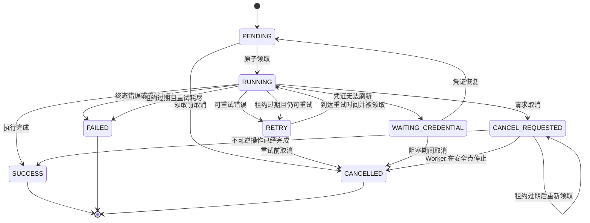

# Worker 与 Task Engine v2 架构

- 状态：提议中
- 目标版本：v0.2 Foundation
- 范围：Worker 进程边界、任务状态机、执行历史、领取与租约协议
- 最后更新：2026-07-23

## 决策摘要

MediaSync v0.2 将 API、Scheduler 和 Worker 拆成独立进程，同时继续默认使用
SQLite 和单 Worker。

API 和 Scheduler 可以创建任务，但只有 Worker 可以执行任务或完成执行状态转换。
API 可以调用 Task Engine 的协作式取消命令，但不得执行或结束运行中的任务。
任务队列状态继续保存在 `tasks`，每次执行尝试记录在 `task_runs`。

SQLite 部署只支持一个 Worker 进程，任务并发数为 `1`。只有未来设计并验证
PostgreSQL 部署方案后，才考虑多 Worker。

默认部署明确不引入 Redis、RabbitMQ、Celery 或 Kubernetes。未来 PostgreSQL
后端可以支持多 Worker，但这不是 v0.2 要求。

文中的 **必须**、**不得**、**应该** 和 **可以** 均为规范性要求。

## 1. 背景

MediaSync v0.1 在一个 FastAPI 进程中运行 API 和全部后台任务：

```text
FastAPI
├── HTTP API
├── APScheduler
├── 扫描执行
└── 转存执行
```

这种方式适合验证功能 MVP，但它把后台任务绑定到了 API 生命周期：

- API 重启或升级会中断同步任务。
- 缓慢的 Provider 请求会占用 API 事件循环和数据库 Session。
- 手动扫描通过 FastAPI `BackgroundTasks` 执行。
- APScheduler 直接调用扫描和转存服务。
- 队列状态、执行历史和用户日志共用 `tasks` 表。
- 进程内调度锁和请求节流无法跨进程协调。
- 没有原子领取、租约、心跳或 fencing。
- 横向扩展 API 也会复制 Scheduler 和 Worker。

MediaSync 正在从单机工具演进为可以长期无人值守运行在 NAS 上的服务。

目标拓扑：

```text
                    mediasync-api
                         │
                         │ 创建和查询任务
                         ▼
                       SQLite
                      ▲      ▲
        创建到期扫描  │      │ 领取并执行
                      │      │
        mediasync-scheduler   mediasync-worker
```

三个进程使用同一后端镜像和代码库，但用不同命令启动。

### 1.1 目标

v0.2 必须提供：

- API、Worker、Scheduler 或 NAS 重启后任务仍然持久。
- 原子任务领取，不出现重复所有权。
- Worker 租约、心跳、崩溃检测和恢复。
- 幂等的调度和转存任务创建。
- 每次执行尝试都有持久化历史。
- 可以从订阅或文件追踪到 Task 及其 Run。
- 适合 NAS 用户的 SQLite 单 Worker 默认部署。
- 为后续 Provider SDK v2 提供清晰边界。

### 1.2 非目标

本设计不包含：

- 新云盘 Provider；
- SQLite 多 Worker；
- Redis、RabbitMQ、Celery、Kafka 或其他外部队列；
- Kubernetes 或云原生控制平面；
- 多用户授权；
- STRM 生成或媒体库集成；
- 通用工作流引擎。

## 2. 进程边界

进程边界是架构不变量，不是部署建议。

### 2.1 `mediasync-api`

API 进程负责同步处理用户意图和读取模型。

它可以：

- 增删改、启用和停用订阅；
- 管理云盘账号和凭证；
- 查询 Task 和 Task Run；
- 创建手动扫描任务；
- 创建用户请求的重试；
- 通过 Task Engine 命令请求取消；
- 返回仪表盘和健康信息。

它不得：

- 执行扫描或转存；
- 返回 HTTP 响应后再为后台同步调用 Provider；
- 使用 FastAPI `BackgroundTasks` 执行同步；
- 把任务改为 `RUNNING`、`RETRY`、`SUCCESS` 或 `FAILED`；
- 恢复过期租约；
- 启动 APScheduler。

手动触发扫描的 API 只能创建或返回排队任务，并返回 HTTP `202`。

### 2.2 `mediasync-scheduler`

Scheduler 只有一个业务职责：

```text
查找到期订阅
      ↓
创建 SCAN 任务
      ↓
推进 next_scan_at
      ↓
结束
```

它可以：

- 读取 `next_scan_at` 已到期的启用订阅；
- 幂等插入 `SCAN` 任务；
- 推进 `subscription.next_scan_at`；
- 发布服务心跳。

它不得：

- 执行扫描或转存；
- 领取任务；
- 刷新云盘凭证；
- 调用云盘 Provider；
- 执行任务重试或租约恢复。

创建定时任务和推进 `next_scan_at` 必须位于同一个数据库事务中。幂等键必须由
订阅和计划发生时间推导，例如：

```text
scan:{subscription_id}:{scheduled_for_utc}
```

Scheduler 崩溃后重复处理同一计划时，唯一幂等键可使重复插入无害。

默认 v0.2 部署只支持一个 Scheduler 进程。

### 2.3 `mediasync-worker`

Worker 是唯一的任务执行器，也是执行状态转换的唯一所有者。

它必须：

- 原子领取一个符合条件的任务；
- 每次尝试创建一条 `task_runs`；
- 执行期间维护任务租约；
- 把任务分派给对应执行器；
- 持久化领域变更和终态 Run 结果；
- 为扫描发现的文件幂等创建转存任务；
- 恢复过期租约；
- 发布服务心跳。

默认 v0.2 SQLite 部署必须只运行一个 Worker，任务并发数为 `1`。即使领取协议
能够防止重复所有权，在同一个 SQLite 数据库上启动更多 Worker 仍不受支持。

### 2.4 共享领域代码

API、Scheduler 和 Worker 可以共享：

- SQLAlchemy Model 和 Repository；
- Pydantic/领域数据结构；
- 任务入队辅助函数；
- Provider 实现；
- 凭证加密和配置。

API Router 不得导入执行函数，Scheduler 代码不得导入扫描或转存执行器。

## 3. 任务状态机

初始任务类型保持：

- `SCAN`
- `TRANSFER`

本文用大写表示规范状态名，数据库值应该使用稳定的小写字符串。

### 3.1 状态

| 状态 | 含义 |
|---|---|
| `PENDING` | 可以立即领取。 |
| `RUNNING` | 由持有有效租约的 Worker 拥有。 |
| `RETRY` | 发生可重试失败，等待到 `next_attempt_at`。 |
| `WAITING_CREDENTIAL` | 相关账号凭证恢复前保持阻塞。 |
| `CANCEL_REQUESTED` | 等待协作式取消或对账。 |
| `SUCCESS` | 成功完成。 |
| `FAILED` | 终态失败或重试预算耗尽。 |
| `CANCELLED` | 已完成取消，且没有把未经验证的副作用误报为成功。 |

### 3.2 状态转换



恢复延迟为零时，过期租约可以直接回到 `PENDING`；否则进入 `RETRY` 并计算
`next_attempt_at`。

终态不得回到可执行状态。用户重试应创建新的业务任务或显式关联的后继任务，
不得抹掉旧 Task 或其 Run。

### 3.3 取消语义

取消采用协作方式：

- `PENDING`、`RETRY` 或 `WAITING_CREDENTIAL` 没有活动执行器，可以直接转为
  `CANCELLED`。
- `RUNNING` 必须先转为 `CANCEL_REQUESTED`，不得直接变成 `CANCELLED`。
- 所有者在任务处于 `CANCEL_REQUESTED` 时继续心跳，并在安全边界检查取消。
- 不强制终止 Provider HTTP 请求；Worker 必须先对账其结果，再选择终态。
- 不可逆 Provider 操作已经成功时，Worker 必须保存真实结果，可以结束为
  `SUCCESS`，不得把成功转存报告为已取消。
- 请求取消期间租约过期时，恢复流程把 Run 标为 `lost`，并让 Task 保持可重新
  领取的 `CANCEL_REQUESTED`。新所有者结束任务前先对账未知 Provider 结果。

取消并不保证回滚远端云盘操作，API 和 UI 必须说明这一限制。

### 3.4 凭证阻塞语义

凭证异常不一定等于任务失败：

- 临时刷新超时或 Provider 5xx 响应进入 `RETRY`，使用正常退避。
- 凭证被撤销、无效或无法刷新时进入 `WAITING_CREDENTIAL`。
- 进入 `WAITING_CREDENTIAL` 时，当前 Run 以 `blocked` 结束，清理任务所有权，
  且不消耗重试预算。
- 阻塞任务不得被反复轮询，也不得发送给 Provider。
- 相关账号更新并通过校验后，由 Task Engine 命令把其阻塞任务移到 `PENDING`。
- 凭证恢复只能唤醒与已校验账号关联的任务，且必须幂等。

UI 应展示阻塞账号和原因，但不得暴露 Token、Cookie 或原始 Provider 响应。

### 3.5 状态所有权

| 状态转换 | 所有者 |
|---|---|
| 创建 `PENDING` 任务 | API、Scheduler 或 Worker 执行器 |
| `PENDING/RETRY → RUNNING` | Worker 领取操作 |
| 延长 `RUNNING/CANCEL_REQUESTED` 租约 | 所有者 Worker |
| `RUNNING → SUCCESS/RETRY/FAILED` | 所有者 Worker |
| `RUNNING → WAITING_CREDENTIAL` | 所有者 Worker |
| `WAITING_CREDENTIAL → PENDING` | 凭证恢复 Task Engine 命令 |
| 恢复过期 `RUNNING` | Worker 恢复循环 |
| `PENDING/RETRY/WAITING_CREDENTIAL → CANCELLED` | Task Engine 命令 |
| `RUNNING → CANCEL_REQUESTED` | Task Engine 命令 |
| `CANCEL_REQUESTED → SUCCESS/CANCELLED` | 所有者 Worker |
| 恢复过期 `CANCEL_REQUESTED` | Worker 恢复循环 |

所有转换必须通过 Task Engine Repository。服务和 API Router 不得直接给任务
状态字符串赋值。

## 4. 原子领取设计

以下写法不安全：

```sql
SELECT id
FROM tasks
WHERE status = 'pending'
LIMIT 1;

UPDATE tasks
SET status = 'running'
WHERE id = ?;
```

在任一更新提交前，两个 Worker 都可能选中同一行。

### 4.1 SQLite 领取

SQLite 3.35 及以上支持 `UPDATE ... RETURNING`。Worker 应在一条语句和一个短
事务中领取任务：

```sql
UPDATE tasks
SET
    status = CASE
        WHEN status = 'cancel_requested' THEN 'cancel_requested'
        ELSE 'running'
    END,
    locked_by = :worker_id,
    lock_token = :lock_token,
    locked_at = :now,
    lease_until = :lease_until,
    updated_at = :now
WHERE id = (
    SELECT id
    FROM tasks
    WHERE (
        status IN ('pending', 'retry')
        AND (next_attempt_at IS NULL OR next_attempt_at <= :now)
      )
       OR (
        status = 'cancel_requested'
        AND locked_by IS NULL
      )
    ORDER BY priority DESC, created_at ASC
    LIMIT 1
)
  AND status IN ('pending', 'retry', 'cancel_requested')
RETURNING *;
```

返回一行表示领取成功；没有返回表示当前无任务，Worker 可以等待后再次轮询。

领取事务还必须：

1. 确定下一个运行序号；
2. 插入状态为 `running` 的 `task_runs`；
3. 在任何 Provider 或网络调用开始前提交。

SQLite 同时只允许一个 Writer，默认单 Worker 拓扑可以接受。事务必须保持短小，
并应该配置有界 `busy_timeout`。

### 4.2 Fencing

只有 `locked_by` 并不够。暂停的 Worker 可能在租约过期、任务被新 Worker 重新
领取后恢复运行。

每次领取必须生成不可预测的 `lock_token`。心跳和完成更新必须匹配：

```sql
WHERE id = :task_id
  AND status IN ('running', 'cancel_requested')
  AND locked_by = :worker_id
  AND lock_token = :lock_token
```

更新影响零行时，说明 Worker 已失去所有权，不得写入终态结果。

### 4.3 未来 PostgreSQL 领取

PostgreSQL 将来可以使用 `SELECT ... FOR UPDATE SKIP LOCKED`，但这不会改变
Task Engine 契约。数据库专用领取 SQL 应隐藏在 Repository 接口之后。

即使领取协议设计为安全，SQLite 多 Worker 仍不受支持。

## 5. 租约与心跳

初始默认值：

- 租约时长：90 秒；
- 心跳间隔：30 秒；
- Worker 任务轮询间隔：1–3 秒并带抖动；
- 恢复检查间隔：30 秒。

以上参数都必须可配置。

### 5.1 心跳

任务运行时，所有者 Worker 定期执行：

```sql
UPDATE tasks
SET
    lease_until = :new_lease_until,
    updated_at = :now
WHERE id = :task_id
  AND status IN ('running', 'cancel_requested')
  AND locked_by = :worker_id
  AND lock_token = :lock_token;
```

心跳使用独立且短生命周期的数据库 Session。扫描或转存等待 Provider HTTP 请求
时，不得持有数据库写事务。

心跳更新零行表示执行器已经失去所有权，它必须在下一个安全取消点停止。

### 5.2 过期租约恢复

Worker 恢复循环查找：

```text
status in (RUNNING, CANCEL_REQUESTED)
and lease_until < now
```

对每个过期任务，它原子执行：

1. 把活动 `task_run` 标为 `lost`；
2. 保存 `WORKER_LEASE_EXPIRED` 等原因；
3. 增加任务重试计数；
4. 清理 `locked_by`、`lock_token`、`locked_at` 和 `lease_until`；
5. 将任务移动或保留为：
   - 已请求取消时，保持可重新领取的 `CANCEL_REQUESTED`；
   - 允许立即恢复时，进入 `PENDING`；
   - 需要退避时，进入 `RETRY`；
   - 重试预算耗尽时，进入 `FAILED`。

恢复必须幂等。只有仍携带该过期 `lock_token` 的行可以被恢复。

### 5.3 优雅停止

Worker 停止时：

1. 停止领取新任务；
2. 继续为当前任务发送心跳；
3. 尝试在可配置宽限期内结束；
4. 宽限期耗尽时停止，但不得错误标记成功。

进程被中断后，由正常租约恢复处理未完成 Run。

## 6. 分离 `tasks` 与 `task_runs`

### 6.1 `tasks`

Task 表示一个持久化业务意图，例如：

```text
为订阅 42 扫描 2026-07-23T10:00:00Z 这一计划批次
```

建议字段：

| 字段 | 用途 |
|---|---|
| `id` | 主键。 |
| `type` | `scan` 或 `transfer`。 |
| `status` | 队列状态。 |
| `priority` | 值越高越先领取。 |
| `account_id` | 用于执行和凭证阻塞的云盘账号。 |
| `subscription_id` | 关联订阅，如适用。 |
| `file_id` | 关联索引文件，如适用。 |
| `payload_version` | Task Payload 的明确解析器版本。 |
| `payload` | 任务专用、不可变的 JSON 输入。 |
| `idempotency_key` | 唯一业务操作键。 |
| `retry_count` | 已完成但未成功的尝试数。 |
| `max_retries` | 重试预算。 |
| `next_attempt_at` | 最早重试时间。 |
| `blocked_reason` | 不可运行阻塞状态的标准化原因。 |
| `blocked_at` | 进入当前阻塞状态的时间。 |
| `cancel_requested_at` | 请求协作式取消的时间。 |
| `locked_by` | 当前 Worker 实例。 |
| `lock_token` | 当前领取的 fencing token。 |
| `locked_at` | 领取时间。 |
| `lease_until` | 所有权到期时间。 |
| `last_error_code` | 最新标准化错误码。 |
| `last_error_message` | 最新脱敏错误摘要。 |
| `created_at`、`updated_at` | 审计时间。 |
| `completed_at` | 终态完成时间。 |

建议索引：

```text
UNIQUE(idempotency_key)
INDEX(status, next_attempt_at, priority, created_at)
INDEX(subscription_id, created_at)
INDEX(account_id, status)
INDEX(file_id, created_at)
INDEX(status, lease_until)
```

### 6.2 `task_runs`

Task Run 表示一次执行尝试：

```text
task 123
├── run 1：网络不可用，失败
└── run 2：重试后成功
```

建议字段：

| 字段 | 用途 |
|---|---|
| `id` | 主键。 |
| `task_id` | 父 Task。 |
| `run_number` | Task 内单调递增的尝试序号。 |
| `worker_id` | 执行本次尝试的 Worker。 |
| `lock_token` | 本次尝试对应的领取 token。 |
| `status` | `running`、`success`、`failed`、`blocked`、`lost` 或 `cancelled`。 |
| `started_at`、`finished_at` | 尝试时间。 |
| `last_heartbeat_at` | 最后确认活动时间。 |
| `duration_ms` | 推导出的执行时长。 |
| `result_summary` | 可读且脱敏的摘要。 |
| `error_code`、`error_message` | 标准化失败信息。 |
| `metrics` | 带版本的 JSON 指标。 |
| `created_at`、`updated_at` | 审计时间。 |

必须有 `UNIQUE(task_id, run_number)`。

扫描指标示例：

```json
{
  "schema_version": 1,
  "folders_scanned": 100,
  "items_seen": 1200,
  "items_discovered": 5,
  "transfer_tasks_created": 5,
  "api_request_count": 112
}
```

v0.2 默认保留 Task Run。未来归档策略必须保留汇总结果，不得静默删除近期失败
证据。

### 6.3 原子完成

在可行范围内，Task 完成与领域状态变更必须原子提交。例如成功转存事务应更新：

- 文件记录；
- Task 状态；
- 当前 Task Run。

终态更新必须包含所有权 fencing 条件。如果 Worker 已不再拥有该 Task，就不得
把文件或 Task 标记为成功。

### 6.4 Payload 版本

每个 Task 都必须在不可变 JSON Payload 之外，明确保存 `payload_version`：

```json
{
  "payload_version": 1,
  "payload": {
    "file_id": 123
  }
}
```

Task 类型和 Payload 版本共同选择特定 Pydantic 解析器。Worker 不得根据碰巧
存在的字段猜测版本。

兼容规则：

- Task 入队后，Payload 和版本不得修改。
- 部署必须保留其非终态任务所需的解析器。
- 未知版本以 `UNSUPPORTED_TASK_PAYLOAD_VERSION` 失败；不得猜测、静默升级或
  发送给 Provider。
- 改变 Payload 结构的迁移，要么保留旧解析器，要么在移除旧解析器前显式迁移
  排队中的 Payload。
- 只有已部署 Worker 能读取新版本后，任务生产者才能开始写入该版本。

### 6.5 事件时间线扩展点

`task_runs` 保存尝试摘要，不保存每个生命周期事件。Task Engine 必须提供事件
Sink 边界，使未来可以在不修改执行器的情况下增加持久化 `task_events` 时间线。

预留事件名：

```text
task.created
task.claimed
task.cancel_requested
scan.started
file.discovered
transfer.started
transfer.succeeded
task.retry_scheduled
task.failed
task.cancelled
```

每个事件封装应包含 `task_id`、可选 `task_run_id`、事件名、时间、序号和脱敏且
带版本的 JSON 数据。凭证和原始 Provider 响应不得出现在事件数据中。

首次 Task Engine 实现不要求持久化完整 `task_events` 表或构建对应 UI。v0.2
应把相同的规范事件名输出到结构化日志；后续迁移可以将其持久化为用户时间线。

## 7. 执行模型

### 7.1 扫描执行

`SCAN` 执行器：

1. 读取不可变 Task 输入和当前订阅；
2. 校验订阅仍存在且已启用；
3. 调用 Provider 时不持有长数据库事务；
4. 分批写入扫描检查点；
5. 为发现的文件幂等创建 `TRANSFER` 任务；
6. 在当前 Task Run 中记录扫描指标；
7. 使用自己的 lock token 结束 Task。

转存任务键应该继续包含源文件标识和指纹：

```text
transfer:{subscription_id}:{remote_file_id}:{target_account_id}:{target_folder_id}:{fingerprint}
```

### 7.2 转存执行

`TRANSFER` 执行器：

1. 读取索引文件、订阅和目标引用；
2. 解析或校验目标目录；
3. 应用已配置的冲突/幂等策略；
4. 执行 Provider 转存；
5. 原子更新文件和 Run 结果。

`target_folder_id` 应成为 v0.2 的稳定目标引用。Task Engine 拆分后，应移除每个
文件都重复遍历路径的行为。

### 7.3 错误分类

执行器返回标准化结果，不直接给 Task 状态赋值：

```text
Success(result, metrics)
RetryableFailure(code, message, retry_after)
CredentialBlocked(code, account_id, message)
TerminalFailure(code, message)
Cancelled(result, metrics)
OwnershipLost
```

Provider 异常必须映射为这些结果。原始 Provider 响应、Token、Cookie 和凭证
不得保存到 Task 或 Run 消息中。

### 7.4 幂等与远端副作用边界

SQLite 和云盘 Provider 无法加入同一个原子事务。因此 Task Engine 保证
at-least-once 执行，并通过幂等与对账实现 effectively-once 转存行为，不宣称
不可能实现的 exactly-once 交付。

转存幂等键必须标识完整业务操作：

```text
subscription_id
+ remote_file_id
+ source fingerprint or revision
+ target_account_id
+ target_folder_id
```

唯一 Task 键可以防止重复队列意图，但不足以单独阻止远端重复副本。转存执行器
必须：

1. 调用 Provider 前检查持久化文件/转存记录；
2. 上次尝试可能跨过“远端成功、本地提交失败”边界时，先对账目标；
3. Provider 支持时传入客户端幂等键；
4. 成功后保存目标文件 ID 或其他稳定远端凭据；
5. 只有持久化领域记录提交后，才把 Task 标为 `SUCCESS`。

如果 `copy_file()` 成功而 SQLite 提交失败，下一次尝试必须先对账，再复制。
Provider SDK v2 必须提供 `ensure_transfer` 或等价能力，以区分：

```text
已经完成
可以安全执行
结果未知，需要对账
```

只按文件名检查是否存在并不充分，因为不同源文件可能合法地使用相同名称。

## 8. Provider 重构顺序

未来云盘需要 Provider SDK v2，但它必须排在 Task Engine 和 Worker 拆分之后：

```text
Task Engine 契约
        ↓
Worker 执行边界
        ↓
Provider SDK v2
        ↓
通用凭证模型
        ↓
更多 Provider
```

原因在于 Provider SDK v2 会改变完整执行调用链。如果在定义任务所有权、重试和
执行结果前重构，之后很可能需要再次重写。

Provider SDK v2 以后应拆分为：

```text
AccountProvider
CredentialProvider
ShareProvider
StorageProvider
TransferProvider
```

v0.2 Foundation 期间不得增加新 Provider。

## 9. SQLite 与部署模型

受支持的默认部署：

```text
SQLite WAL
+ 一个 API 进程
+ 一个 Scheduler 进程
+ 一个 Worker 进程
```

要求：

- 所有进程挂载同一个本地数据卷。
- 每个 SQLite 数据库只能连接一个 `mediasync-worker`，任务并发数必须为 `1`。
- Docker Compose 必须声明一个 Worker 副本，运维人员不得横向扩展 SQLite
  Worker 服务。
- SQLite 必须位于具备可靠文件锁的文件系统。
- 未经明确验证，不支持网络文件系统。
- 队列操作事务必须保持短小。
- Provider 网络调用必须位于写事务之外。
- Docker Compose 必须先完成数据库迁移，再开始正常处理。
- Scheduler 和 Worker 必须等待迁移完成。

未来高级模式可以使用：

```text
PostgreSQL
+ 多个 API 进程
+ 一个 Scheduler
+ 多个 Worker
```

PostgreSQL 和多 Worker 不属于 v0.2 验收要求。只有 PostgreSQL 方案具备数据库
专用领取测试、租约测试和部署文档后，多 Worker 才成为受支持配置。

## 10. 故障行为

| 故障 | 要求行为 |
|---|---|
| API 重启 | 已有 Worker 任务继续运行。 |
| 前端重新构建 | 不影响 Scheduler 或 Worker。 |
| Scheduler 重启 | 已有任务继续；重启后创建到期扫描。 |
| Worker 崩溃 | 租约过期，Run 变为 `lost`，Task 重试或失败。 |
| NAS 重启 | 服务恢复后，非终态 Task 自动恢复。 |
| 网络中断 | 可重试失败使用有界指数退避。 |
| Provider 限流 | 可用时遵循 `Retry-After`。 |
| Token 过期 | 在账号级协调下刷新一次；无法刷新时转为 `WAITING_CREDENTIAL`。 |
| 数据库忙 | 用有界退避重试短队列事务。 |
| Scheduler 重复触发 | 唯一 Task 键防止重复扫描意图。 |
| 重复发现文件 | 唯一转存键防止重复转存意图。 |
| 远端复制成功、本地提交失败 | 再次复制前先对账目标。 |
| Provider 调用期间请求取消 | Worker 保持租约并先对账调用结果。 |
| 旧 Worker 恢复 | `lock_token` fencing 阻止旧所有者结束任务。 |

## 11. 可观测性与健康契约

每个进程都必须有稳定实例 ID 并发布心跳。

API 健康响应最终应区分：

```json
{
  "api": true,
  "database": true,
  "worker": true,
  "scheduler": true
}
```

Task 日志必须携带：

- `task_id`
- `task_run_id`
- `worker_id`
- `subscription_id`（如适用）
- 请求/关联 ID（如适用）

应用日志不能代替 `task_runs`，`task_runs` 也不能代替应用日志。

## 12. 迁移策略

迁移必须是增量且可恢复的：

1. 向 `tasks` 增加账号、领取、租约、重试、凭证阻塞、优先级、取消、
   `payload_version` 和完成字段。
2. 增加 `task_runs`。
3. 回填现有任务状态和执行历史。
4. 增加 Task Engine Repository，并先在现有单进程运行时中采用。
5. 修改进程边界前，证明新状态机、Payload 解析器、重试、取消和幂等行为。
6. 增加 Worker 命令，并把执行移到 Worker 之后。
7. 增加只负责入队的 Scheduler 命令。
8. 停用进程内 APScheduler 和 FastAPI 同步后台任务。
9. 更新 Docker Compose，启动 API、Scheduler 和一个 Worker。
10. 观察一个迁移版本，再删除兼容代码。

状态模型和进程拆分必须作为可独立测试的步骤落地。同时修改会让故障难以定位和
回滚。

Alembic 是唯一生产数据库结构迁移权威。不得使用
`Base.metadata.create_all()` 升级已有数据库。

回滚文档必须说明：

- 哪些迁移版本与上一应用版本兼容；
- 如何安全停止 Worker 和 Scheduler；
- 如何恢复迁移前 SQLite 备份。

## 13. 验证计划

自动化集成测试至少覆盖：

- 两次领取不能同时拥有同一个 Task。
- 心跳只能延长匹配 lock token 的租约。
- 旧 Worker 不能结束已被重新领取的 Task。
- 过期或未知 Payload 版本在调用 Provider 前被拒绝。
- 过期租约产生 lost Run 和重试。
- 重试耗尽产生一个终态失败 Task。
- 无法刷新的凭证阻塞 Task，但不消耗重试预算。
- 账号成功校验只唤醒该账号的阻塞 Task。
- PENDING Task 可以在不创建 Run 的情况下取消。
- RUNNING Task 转为 `CANCEL_REQUESTED`，并且只能由所有者结束。
- Provider 调用期间取消仍保留真实远端结果。
- Scheduler 重启不重复创建定时扫描 Task。
- Worker 重启恢复 PENDING 和过期 Task。
- API 重启不中断 Worker 执行。
- 扫描两次发现同一文件时只创建一个转存 Task。
- 远端复制后本地提交失败，重试不会创建第二份副本。
- 网络故障恢复后完成 Task，且不丢失。
- NAS 式全服务重启恢复全部非终态 Task。
- SQLite 部署拒绝大于 `1` 的 Worker 并发。
- 从 v0.1 结构迁移时保留 Task 和文件历史。

可靠性测试还应包含：

- 至少 1,000 个项目的分享；
- 临时断网；
- Provider 429 和 5xx；
- 过期和轮换 Token；
- 扫描或转存期间终止 Worker；
- 数据库锁竞争；
- 重复 Docker Compose 重启。

开始夸克网盘开发前，维护者应先让 v0.2 架构在真实 NAS 工作负载下长期
dogfooding。

## 14. 非功能要求

这些要求是发布门槛，不是可选实现建议。它们解释了为什么任何功能都不能绕过
状态、租约、fencing、幂等和迁移不变量。

### 14.1 可靠性要求

| ID | 场景 | 要求结果 |
|---|---|---|
| `NFR-R01` | Worker 执行期间 NAS 重启。 | 服务健康后，每个非终态 Task 都在租约和恢复窗口内恢复。中断 Run 保留为 `lost`，新 Run 记录恢复，且不产生重复转存意图。 |
| `NFR-R02` | 阿里云盘超时、限流或返回可重试 5xx。 | 标准化错误，Task 进入 `RETRY`，带抖动的有界指数退避避免高频重试；有效的 `Retry-After` 优先。 |
| `NFR-R03` | 凭证过期或被撤销。 | MediaSync 尝试协调刷新。无法刷新时进入 `WAITING_CREDENTIAL` 而非 `FAILED`；账号校验成功后唤醒任务，且不消耗重试预算。 |
| `NFR-R04` | 远端转存成功，但本地提交失败。 | 下一次尝试在复制前对账远端目标或稳定凭据，不得明知会重复仍执行转存。 |
| `NFR-R05` | Scheduler 在发现订阅与推进计划之间重启。 | Task 插入和 `next_scan_at` 更新保持原子，发生时间幂等键阻止重复计划意图。 |
| `NFR-R06` | API 对手动触发返回成功。 | 返回 HTTP `202` 前 Task 已持久化，不存在只保存在进程内存的同步意图。 |
| `NFR-R07` | v0.1 安装升级到 v0.2。 | Alembic 保留订阅、文件、Task 历史和凭证；升级说明要求迁移前备份，并记录版本兼容的回滚或恢复方式。 |
| `NFR-R08` | 运维人员调查失败或恢复 Task。 | 无需只依赖容器日志，就能追踪 Task、每个 Run、标准化错误、Worker 标识、时间和关联字段。 |
| `NFR-R09` | 错误和事件包含 Provider 上下文。 | 日志、Task、Run、指标和事件绝不保存 refresh token、Cookie、Authorization Header 或未脱敏的原始 Provider 响应。 |

### 14.2 重试策略

默认重试延迟由可配置的基准值、指数、最大延迟和抖动计算：

```text
delay = min(max_delay, base_delay * 2 ^ retry_count)
scheduled_delay = full_jitter(0, delay)
```

Provider `Retry-After` 有效且不超过运维安全上限时优先使用。凭证阻塞 Task 不进入
此重试循环。

不同 Task 类型和标准化错误码可以使用不同重试上限与延迟，但执行器不得在 Task
Engine 之外实现私有 sleep-and-retry 循环。

### 14.3 验收证据

每项可靠性要求都应在可行时由自动化集成测试或迁移测试支持。重启恢复、数据库
备份/恢复和远端对账，还必须在宣布 v0.2 稳定前提供 Docker Compose 或 NAS 式
故障注入证据。

## 15. v0.2 Foundation 验收标准

发布目标：

> MediaSync 可以在 NAS 上连续数周无人值守运行。

满足以下条件后，v0.2 Foundation 才可验收：

- NAS 重启后恢复全部非终态 Task。
- API 和前端重启不中断同步执行。
- Worker 崩溃通过租约过期恢复。
- 网络故障使用有界退避自动重试。
- Token 过期或轮换不会静默丢失 Task。
- 无法刷新的凭证等待账号修复，而不是耗尽重试预算。
- Scheduler 重复触发和重复扫描不会产生重复转存。
- 远端成功、本地提交失败后完成对账，且不重复转存。
- 取消不会把未完成或结果未知的远端操作报告为取消成功。
- 每次执行尝试都可以通过 Task Run 追踪。
- 数据库备份与恢复流程已有文档并经过测试。
- CI 验证后端测试、前端构建、迁移和 Docker 镜像。

发布时建议在 README 使用：

```text
v0.2 Foundation

目标：MediaSync 可以在 NAS 上连续数周无人值守运行。
```

## 16. 实现顺序

建议的 v0.2 Foundation 顺序：

1. Worker 与 Task Engine 架构——本文。
2. Task 状态机、版本化 Payload 和 `task_runs` 数据结构。
3. Task Engine Repository、原子领取、租约、fencing、取消和幂等契约。
4. 在当前单进程运行时中采用 Task Engine。
5. 用集成和迁移测试稳定新模型。
6. 拆出 Worker 进程和执行器分派。
7. 拆出只负责入队的 Scheduler 进程。
8. Provider SDK v2。
9. 通用凭证管理。
10. 目标目录 ID 与缓存。
11. 结构化日志、事件 Sink 和服务健康。
12. 数据库备份与恢复。
13. CI 和 Docker 构建流水线。
14. 可靠性与迁移测试。

在 v0.2 Foundation 验收标准满足前，暂停功能开发和新 Provider。
